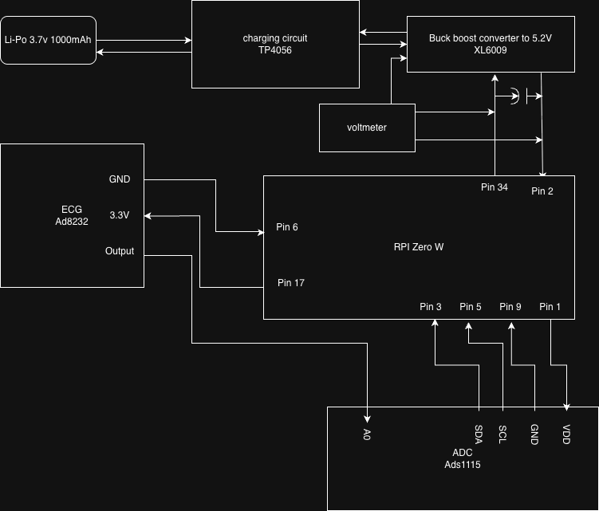
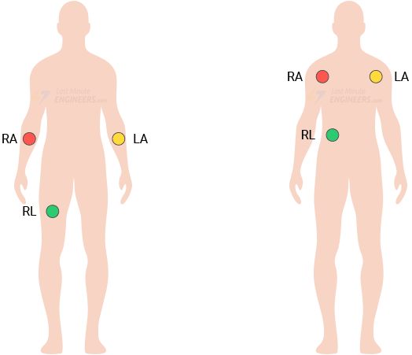

# P.U.L.S.E.
## Portable Unit for Live Signal Electrocardiography

[![Contributors][contributors-shield]][contributors-url]
[![Forks][forks-shield]][forks-url]
[![Stargazers][stars-shield]][stars-url]
[![Issues][issues-shield]][issues-url]

---

## About The Project

**P.U.L.S.E. (Portable Unit for Live Signal Electrocardiography)** is a portable ECG data logging and visualization system designed for educational and experimental use.  
The project captures real-time cardiac electrical signals using an analog ECG sensor and an ADS1115 16-bit ADC, then displays and analyzes the data through a Flask-based web interface.

The system can also generate PDF reports highlighting detected events in the ECG signal.

**Features:**
- Real-time ECG signal acquisition
- High-resolution 16-bit ADC sampling (ADS1115)
- Flask web interface for live visualization
- ECG graph plotting using Matplotlib
- PDF report generation using ReportLab
- Designed for Raspberry Pi Zero platforms

---

## Built With

- [Python](https://www.python.org/)
- [Flask](https://flask.palletsprojects.com/)
- [Matplotlib](https://matplotlib.org/)
- [ReportLab](https://www.reportlab.com/docs/reportlab-userguide.pdf)
- [Adafruit CircuitPython ADS1x15](https://github.com/adafruit/Adafruit_CircuitPython_ADS1x15)

---

## Datasheets & Technical References

All hardware component datasheets used in **P.U.L.S.E.** are stored in the **`datasheets/`** directory of this repository.

Click any document below to view the original manufacturer specifications:

- [AD8232 Heart Rate Monitor v1.0](datasheets/AD8232_Heart_Rate_Monitor_v10.pdf)  
- [adafruit powerboost 1000](datasheets/adafruit-powerboost-1000-basic.pdf)   
- [AD8232 ECG Analog Front-End](datasheets/ad8232.pdf)

### Why these datasheets matter
- Verify **safe voltage and current limits**
- Understand **signal conditioning and filtering**
- Configure **gain, sampling rate, and power management**
- Prevent hardware damage during modifications

> 📁 Directory:
> ```
> datasheets/
> ```

---

## Getting Started

Follow these instructions to set up **P.U.L.S.E.** on a Raspberry Pi Zero and run the system locally.

### Prerequisites

- Raspberry Pi Zero (W or WH recommended)
- Analog ECG sensor (AD8232-based or equivalent)
- ADS1115 16-bit ADC module
- Python 3.11 or higher

---
### Quick Run (Simulation Mode)

If you are developing on a non-Raspberry Pi machine, you can run with a simulated ECG signal:

```bash
ECG_SIMULATE=1 python app.py
```

Open http://localhost:5000 to view the dashboard.

---

## Hardware Wiring & Assembly

**P.U.L.S.E.** uses an **ADS1115 16-bit ADC** to convert the analog ECG signal into digital data, communicating with the Raspberry Pi Zero via **I²C**.

### Raspberry Pi Zero ↔ ADS1115 Wiring

| Raspberry Pi Zero Pin | Function | ADS1115 Pin |
|-----------------------|----------|-------------|
| Pin 1                 | 3.3V     | VDD         |
| Pin 6                 | GND      | GND         |
| Pin 3 (GPIO2)         | SDA      | SDA         |
| Pin 5 (GPIO3)         | SCL      | SCL         |

> ⚠️ The ADS1115 **must be powered at 3.3 V** to maintain safe I²C logic levels with the Raspberry Pi.

### ECG Sensor ↔ ADS1115 Wiring

| ECG Module Pin | ADS1115 Pin |
|---------------|-------------|
| OUT / SIGNAL  | A0          |
| GND           | GND         |

- ECG data is sampled on **ADS1115 channel A0**
- Gain and sampling rate are configured in software

### Wiring Diagram



---

## Safety Notes

### Detection Disclaimer

All arrhythmia/anomaly flags are heuristic and **not** clinically validated. They are for educational use only and should not be used for diagnosis or medical decisions.

---

- This system is **not electrically isolated**
- Do **not** connect to mains-powered equipment while attached to a person
- **Educational and experimental use only**
- **Not a medical device**

---

## Electrode Placement (Educational Use)

Proper electrode placement is essential for accurate ECG acquisition.  
**P.U.L.S.E.** uses a standard **3-electrode configuration**.

### Typical Placement

- **RA (Right Arm):** Right chest or arm
- **LA (Left Arm):** Left chest or arm
- **RL (Reference / Ground):** Lower abdomen or leg

### Placement Diagram



**Image source:**  
https://lastminuteengineers.com/wp-content/uploads/arduino/AD8232-Module-ECG-Electrodes-Placements.png

> ⚠️ **Disclaimer:**  
> This project is for educational purposes only and is **not intended for diagnosis or treatment**.

---

## Installation

### Environment Variables

You can tune sampling and safety settings without code changes:

- `ECG_SAMPLE_RATE` (default: 250)
- `ECG_R_THRESHOLD` (default: 15000)
- `ECG_BUFFER_SEC` (default: 120)
- `ECG_BPM_MAXLEN` (default: 1200)
- `ECG_ASYSTOLE_SEC` (default: 3.5)
- `ECG_BRADY_BPM` (default: 50)
- `ECG_TACHY_BPM` (default: 100)
- `ECG_VTACH_BPM` (default: 150)
- `ECG_BASELINE_WINDOW_SEC` (default: 1.0)
- `ECG_NOISE_WINDOW_SEC` (default: 2.0)
- `ECG_MIN_RR_SEC` (default: 0.25)
- `ECG_PREMATURE_SHORT` (default: 0.8)
- `ECG_PREMATURE_LONG` (default: 1.2)
- `ECG_LOW_AMP_THRESHOLD` (default: 800)
- `ECG_NOISE_DERIV_THRESHOLD` (default: 1200)
- `ECG_BASELINE_WANDER_THRESHOLD` (default: 1500)
- `ECG_CLIP_LOW` (default: 0)
- `ECG_CLIP_HIGH` (default: 32767)
- `ECG_AUTOSTART` (default: 1)
- `ECG_SHUTDOWN_TOKEN` (default: unset; required to enable /shutdown)

---

1. **Update the system**
    ```bash
    sudo apt update && sudo apt upgrade -y
    ```

2. **Enable I²C**
    ```bash
    sudo raspi-config
    ```
    - Interface Options → I2C → Enable
    - Reboot
    ```bash
    sudo reboot
    ```

3. **Clone the repository**
    ```bash
    git clone https://github.com/wernerhzigby/electrocardiograma.git
    cd electrocardiograma
    ```

4. **Load I²C kernel modules (if required)**
    ```bash
    sudo modprobe i2c-bcm2708
    sudo modprobe i2c-dev
    ```
    Verify:
    ```bash
    i2cdetect -y 1
    ```

5. **Install dependencies**
    ```bash
    sudo apt install python3-pip -y
    sudo apt install libopenjp2-7 libjpeg-dev libtiff-dev libpng-dev python3-flask python3-pip python3-dev i2c-tools
    pip3 install -r requirements.txt --break-system-packages
    ```

---

## Usage

1. Start the Flask server:
    ```bash
    python3 app.py
    ```

2. Open a browser:
    ```
    http://<raspberry-pi-ip>:5000
    ```

3. View live ECG signals and generate PDF reports.

---

## Roadmap

- [x] Live ECG acquisition
- [x] Web-based visualization
- [x] PDF report generation
- [x] Automatic event flagging
- [ ] Mobile-optimized interface

---

## Contributing

Contributions are welcome.

1. Fork the project  
2. Create a feature branch (`git checkout -b feature/YourFeature`)  
3. Commit changes (`git commit -m 'Add feature'`)  
4. Push (`git push origin feature/YourFeature`)  
5. Open a pull request  

---

## License

Distributed under the **Unlicense**.  
See `LICENSE.txt` for details.

---

## Contact

**Werner Hohenfeldt Zigby**  
📧 Wernerzigby@gmail.com  

Project Link:  
https://github.com/wernerhzigby/electrocardiograma

---

<!-- MARKDOWN LINKS & IMAGES -->
[contributors-shield]: https://img.shields.io/github/contributors/wernerhzigby/electrocardiograma.svg?style=for-the-badge
[contributors-url]: https://github.com/wernerhzigby/electrocardiograma/graphs/contributors
[forks-shield]: https://img.shields.io/github/forks/wernerhzigby/electrocardiograma.svg?style=for-the-badge
[forks-url]: https://github.com/wernerhzigby/electrocardiograma/network/members
[stars-shield]: https://img.shields.io/github/stars/wernerhzigby/electrocardiograma.svg?style=for-the-badge
[stars-url]: https://github.com/wernerhzigby/electrocardiograma/stargazers
[issues-shield]: https://img.shields.io/github/issues/wernerhzigby/electrocardiograma.svg?style=for-the-badge
[issues-url]: https://github.com/wernerhzigby/electrocardiograma/issues
[license-shield]: https://img.shields.io/github/license/wernerhzigby/electrocardiograma.svg?style=for-the-badge
[license-url]: https://github.com/wernerhzigby/electrocardiograma/blob/main/LICENSE.txt

---

## Development

Run tests:

```bash
pytest
```

Health endpoint:

- `GET /health` returns simulation and hardware status.
